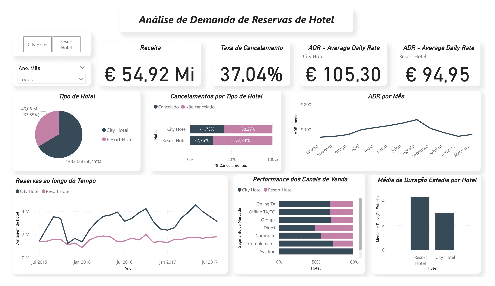
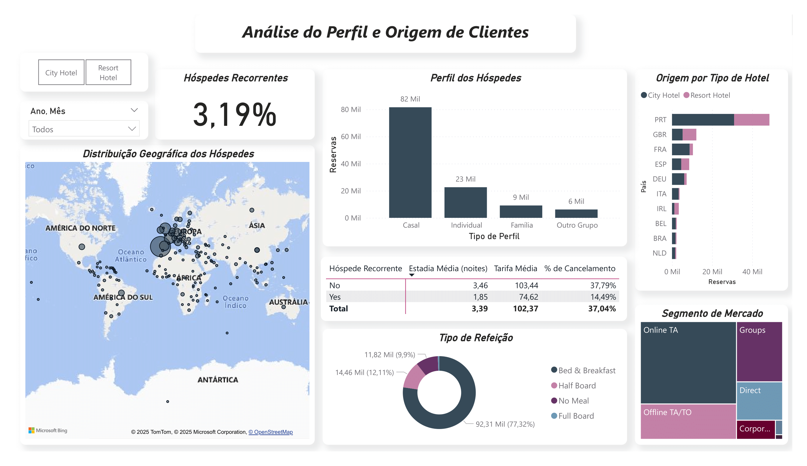
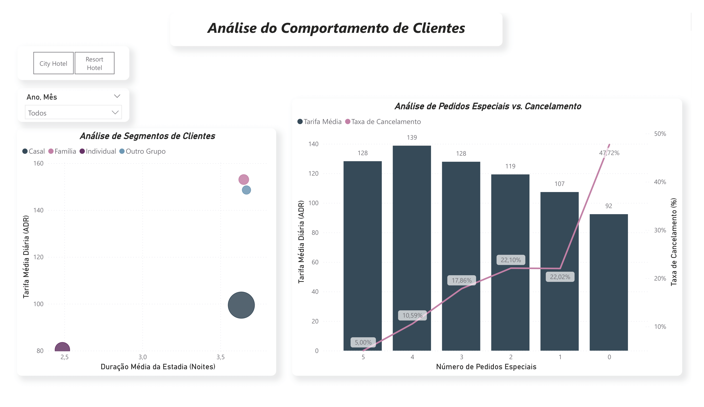

# 📊 Hotel Booking Dashboard  

Este projeto apresenta uma **análise interativa da demanda de reservas de hotéis**, construída em **Power BI** a partir do dataset público disponível no [Kaggle](https://www.kaggle.com/datasets/jessemostipak/hotel-booking-demand).  

O objetivo do dashboard é fornecer insights estratégicos para responder perguntas de negócio relacionadas a receita, comportamento dos clientes e fatores que impactam as reservas e cancelamentos.  

---

## 🎯 O Problema de Negócio

Entender melhor o comportamento dos  clientes e os fatores que influenciam as receitas e taxas de cancelamento. O objetivo é responder a perguntas de negócio cruciais para otimizar as operações, as estratégias de marketing e a precificação.

**Perguntas Chave:**
- **Qual a sazonalidade da procura?**  
  → Identificação de períodos de alta e baixa procura, auxiliando na definição das melhores épocas para campanhas.  

- **Quais fatores mais impactam a taxa de cancelamento?**  
  → Relação entre lead time, pedidos especiais, canais de venda e comportamento do cliente.  

- **Qual o perfil dos nossos hóspedes?**  
  → Origem geográfica, tipo de grupo (casal, família, individual) e segmentação de mercado.  

- **Existem diferenças entre hóspedes novos e recorrentes?**  
  → Análise de lealdade e impacto na tarifa média, tempo de estadia e taxa de cancelamento.  

- **Quem são os segmentos de clientes mais valiosos e como fidelizá-los?**  
  → Combinação entre **ADR (tarifa média diária)** e **duração da estadia** para identificar perfis prioritários.  

---

## ⚙️ Metodologia  

1. **Tratamento e Transformação de Dados (Power Query)**  
   - Importação do arquivo `.csv`.  
   - Correção de tipos de dados (ex.: coluna `adr` para números decimais).  
   - Limpeza e padronização de variáveis.  

2. **Criação de Métricas com DAX**  
   - **Receita Total**: apenas reservas não canceladas.  
   - **Taxa de Cancelamento** (% de reservas canceladas).  
   - **ADR Médio** (tarifa média diária).  
   - **Média de Duração da Estadia** (noites).  
   - **Média de Lead Time**.  
   - **Taxa de Hóspedes Recorrentes**.  

3. **Colunas Calculadas com DAX**  
   - Receita por registro.  
   - Duração total da estadia.  
   - Segmentação de hóspedes por perfil de grupo (ex.: casal, família).  

4. **Estruturação do Dashboard (3 Páginas)**  
   - **Página 1: Visão Geral do Negócio** → Principais KPIs, evolução de reservas e sazonalidade.  
   - **Página 2: Análise de Clientes** → Perfil, origem geográfica e recorrência dos hóspedes.  
   - **Página 3: Análise de Comportamento** → Segmentação de clientes por valor e impacto dos pedidos especiais nos cancelamentos.  

---

## 💡 Insights Principais  

- A **procura é sazonal**, com picos em setembro/outubro e baixa em inverno.  
- **Taxa de cancelamento geral do negócio é de 37%**, sendo maior em City Hotel **(41,73%)**.  
- A grande maioria dos hóspedes vem de Porgutal (PRT). O segmento que gera maior volume de reservas é, de londe, o de **casais**, seguidos de reservas individuais.
- Apenas **3,19% dos hóspedes são recorrentes**, sugerindo oportunidade para programas de fidelização. Hóspedes recorrentes são um ativo de baixo risco. A sua taxa de cancelamento é de apenas **14,6%**, inferior aos **37,8%** registados para hóspedes novos.
- O ato de um cliente fazer pelo menos um pedido especial está relacionado a uma queda na taxa de cancelamento. A taxa de cancelamento para clientes com zero pedidos é altíssima, caindo para perto de zero para clientes que fazem 3 ou mais pedidos.
- Clientes com **maior valor (ADR alto + longa estadia)** tendem a ser famílias e grupos. Embora casais terem um ADR mais moderado, representam o maior volume de reservas com estadias mais longas, posicionando-os como a base do negócio e um segmento com grande oportunidade para aumento de receita.
- Vale a pena investigar melhor o perfil desses grupos (ex.: famílias com crianças, viagens de negócios, grupos de amigos, excursões), pois cada segmento pode demandar estratégias diferenciadas de preço, pacotes e fidelização.

---

## 📷 Prévia do Dashboard  

### Página 1 – Visão Geral do Negócio  
  

### Página 2 – Análise de Clientes  
  

### Página 3 – Análise de Comportamento  
  

---

## 🗂️ Base de Dados  

O dataset utilizado está disponível no Kaggle:  
👉 [Hotel Booking Demand Dataset](https://www.kaggle.com/datasets/jessemostipak/hotel-booking-demand)  

Os dados foram previamente tratados em Python. O processo detalhado pode ser visto no projeto:  
👉 [Hotel Booking Analysis (Python)](https://github.com/gabxrosa/hotel-booking-analysis)  

---

## 📌 Tecnologias Utilizadas  

- **Power BI** (ETL com Power Query + Modelagem e Métricas com DAX)  
- **Python** (tratamento inicial dos dados)  
- **Kaggle Dataset** como fonte de dados  

---

📌 Desenvolvido por Gabrielle Rosa.  
